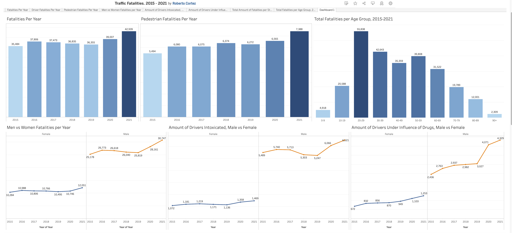

# Fatal Traffic Collisions Dashboard in Tableau 

### Business Task
Analyse fatal traffic collision data and graphing the amount of fatalities per year, per age group and comparing the differences between men and women.

### Data Set
- Fatal traffic collision data from 2015 to 2021 from [National Highway Traffic Safety Administration](https://www.nhtsa.gov/research-data/fatality-analysis-reporting-system-fars).

### Tools
- Tableau for data visualisation - View [dashboard](https://public.tableau.com/app/profile/roberto.cortez/viz/TrafficFatalities_2015-2021/Dashboard1)

### Dashboard

